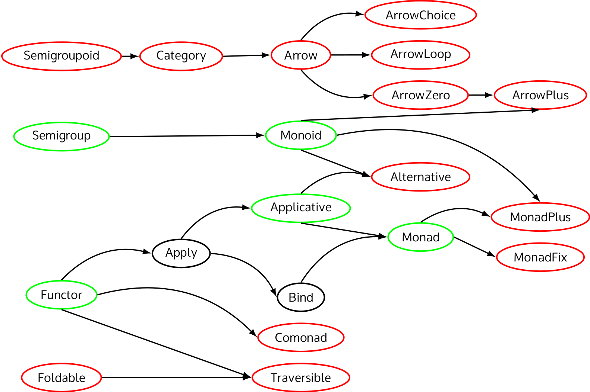

# Coq Typeclass Hierarchy

<!-- Shamelessly stolen readthedocs.io badge -->
[](https://travis-ci.org/siddharthist/coq-typeclass-hierarchy)
[](https://siddharthist.github.io/coq-typeclass-hierarchy/html/toc.html)

This project aims to bring a full-featured hierarchy of typeclasses for
functional programming to Coq, inspired by Haskell
and [PureScript][purescript-prelude].

## Table of Contents

<!-- markdown-toc start - Don't edit this section. Run M-x markdown-toc-generate-toc again -->
**Table of Contents**

- [Coq Typeclass Hierarchy](#coq-typeclass-hierarchy)
    - [Table of Contents](#table-of-contents)
    - [The Hierarchy](#the-hierarchy)
    - [Installation](#installation)
    - [Usage](#usage)
        - [Modules and Importing](#modules-and-importing)
        - [API Documentation](#api-documentation)
    - [Contributing](#contributing)
    - [Design and Related Work](#design-and-related-work)

<!-- markdown-toc end -->

## The Hierarchy


 
 - Solid arrows point from the general to the specific - if there is an arrow
   from `Foo` to `Bar` it means that every `Bar` is a `Foo`.
 - Green nodes are complete, with documentation and (at least one) instance(s).
 - Black nodes are defined, but have no accompanying instances or documentation.
 - Red nodes are incomplete, but planned.
 
## Installation

You can build this package using the [Nix][nix] package manager:
```
nix-build . && ls result/lib/coq/8.5/user-contrib/TypeclassHierarchy/
```
Alternatively, you can use the the standard
```
./configure && make
```

If you're using [Nix][nix], you can easily intergrate this library with your own
package's `default.nix` or `shell.nix`, and your `COQPATH` environment variable
will automatically be set correctly.
```nix
{ stdenv, coq }:
let
  coq_typeclasses = 
    pkgs.callPackage ./path/to/coq-typeclass-hierarchy/default.nix { };
in stdenv.mkDerivation {
  name = "my-coq-project";
  src = ./.;
  buildInputs = [ coq coq_typeclasses ];
  ...
}
```
Otherwise, just copy what you built to somewhere that Coq will find it.

## Usage

### Modules and Importing

Each module in `TypeclassHierarchy.Interfaces` defines all the classes that fall
under that one in the tree. For instance,
`TypeclassHierarchy.Interfaces.Functor` defines `Functor`, `Applicative`,
`Monad`, etc.

### API Documentation
You can [view the documentation online][docs], but to build it locally, run
```
./configure && make html && firefox html/toc.html
```

## Contributing
Pull requests for fixes, new classes, extra instances, or more tests are
welcome! Just run
```
nix-shell
```
to be dropped into a shell with all dependencies installed.
 
## Design and Related Work

Here, we'll examine the key design principles and how they differ from similar
libraries:

 * Scope: This project defines only those typeclasses that have compelling use
   cases for functional programming. This gives us slightly more than Haskell,
   but fewer than PureScript.
     - [math-classes][math-classes] is focused on building the Algebraic
       Hierarchy, rather than one for functional programming.
     - [coq-haskell](https://github.com/jwiegley/coq-haskell) brings the Haskell
       typeclasses to Coq, but also includes many other parts of the Haskell
       standard library.
     - [haskell-coq](https://github.com/domdere/haskell-coq) is also similar,
       but is limited to the Haskell typeclasses, and seems stalled at the
       moment.
 * Bundling of Laws and Functional Extensionality: The only worthwhile instances
   of typeclasses are lawful ones. Therefore, this library packages the
   interfaces (`fmap`, `bind`) together with proofs that the laws hold. However,
   some laws include assertions of function equality (think `fmap id = id`),
   which is not a native concept to Coq. Therefore, we use a Setoid which
   encodes extensional equality and allows us to use the setoid rewriting
   tactics when proving it.
     - [coq-haskell](https://github.com/jwiegley/coq-haskell) uses the function
       extensionality axiom in the limited sections where it proves the laws for
       its instances. This approach is less flexible than one based on Setoids,
       and since the library (rightly) doesn't want to require users to accept
       this axiom, the laws and interfaces are unbundled, as in Haskell. This
       causes us to lose the compile-time guarantees of Coq.

[docs]: https://siddharthist.github.io/coq-typeclass-hierarchy/html/toc.html
[nix]: https://nixos.org/nix/
[math-classes]: https://github.com/math-classes/math-classes
[purescript-prelude]: https://github.com/purescript/purescript-prelude
